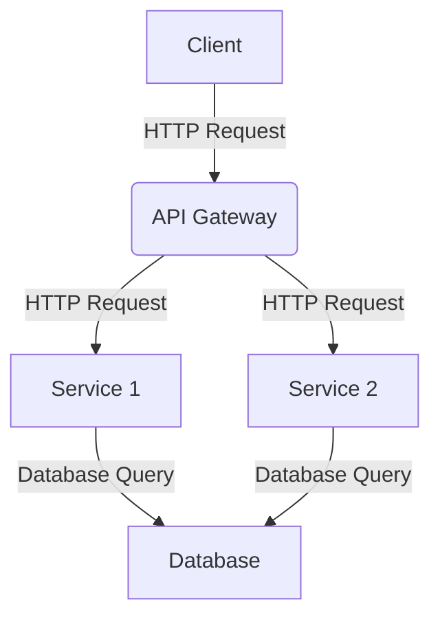

# 🤖 Prompts ChatGPT pour les Développeurs

Bienvenue dans ma collection personnelle de prompts ChatGPT pour les développeurs ! 🙌

Ce dépôt contient une liste de prompts puissants de ChatGPT qui peuvent vous aider à stimuler votre créativité. 💡 Que vous soyez débutant ou professionnel expérimenté, ces prompts peuvent vous aider à penser différemment et à trouver de nouvelles solutions aux problèmes. 🚀

La liste est divisée en catégories : [ prompts pour les codeurs, étudiants, marketeurs et rédacteurs de contenu ]. Peu importe votre profession, il y a quelque chose ici pour tout le monde ! 😊 Plongeons directement dans ces prompts puissants de ChatGPT qui peuvent aider à élever votre créativité à un niveau supérieur ! 🌊

## Table des Matières

Prompts pour les Codeurs

- [🚩 Conseils](#-conseils)
- [🔗 Une approche multi-prompts (chaînage de prompts)](#-une-approche-multi-prompts-chaînage-de-prompts)
  - [1. Moderniser et ajouter les meilleures pratiques](#1-moderniser-et-ajouter-les-meilleures-pratiques)
  - [2. Réviser votre code pour des erreurs logiques et des préoccupations de sécurité](#2-réviser-votre-code-pour-des-erreurs-logiques-et-des-préoccupations-de-sécurité)
  - [3. Valider les recommandations (réflexion)](#3-valider-les-recommandations-réflexion)
  - [4. Écrire le Code](#4-écrire-le-code)
  - [5. Créer des Tests](#5-créer-des-tests)
- [Réécrire le Prompt](#réécrire-le-prompt)
- [Optimiseur de prompt ChatGPT](#optimiseur-de-prompt-chatgpt)
- [Demander des alternatives](#demander-des-alternatives)
- [Documentation / Explication](#documentation--explication)
  - [📣 Ajouter de la Documentation](#-ajouter-de-la-documentation)
  - [📣 Rédiger vos conditions générales](#-rédiger-vos-conditions-générales)
  - [📣 Produire des fiches pratiques](#-produire-des-fiches-pratiques)
  - [📣 Générer des fichiers Readme](#-générer-des-fichiers-readme)
  - [📣 Rédiger des blogs détaillés](#-rédiger-des-blogs-détaillés)
  - [📣 Expliquer le Code](#-expliquer-le-code)
  - [📣 Diagramme d'Architecture (Mermaid)](#-diagramme-darchitecture-mermaid)
  - [📣 Diagramme de Relation d'Entité (Mermaid)](#-diagramme-de-relation-dentité-mermaid)
- [Refactorisation de Code](#refactorisation-de-code)
  - [📣 Refactoriser le Code](#-refactoriser-le-code)
  - [📣 Moderniser du Code Ancien](#-moderniser-du-code-ancien)
  - [📣 Diviser le Code en Plusieurs Méthodes](#-diviser-le-code-en-plusieurs-méthodes)
  - [📣 Meilleure Performance](#-meilleure-performance)
  - [📣 Ajouter un Paramètre à une Fonction](#-ajouter-un-paramètre-à-une-fonction)
  - [📣 Ajouter des Meilleures Pratiques ou Principes de Codage](#-ajouter-des-meilleures-pratiques-ou-principes-de-codage)
  - [📣 Suivre les Directives de Style de Codage](#-suivre-les-directives-de-style-de-codage)
  - [📣 Détecter et Corriger les Erreurs](#-détecter-et-corriger-les-erreurs)
  - [📣 Déboguer un Composant React](#-déboguer-un-composant-react)
  - [📣 Créer des Tests Unitaires](#-créer-des-tests-unitaires)
  - [📣 Transpiler le Code](#-transpiler-le-code)
  - [📣 Design Réactif](#-design-réactif)
  - [📣 Internationalisation](#-internationalisation)
  - [📣 Ajouter des Commentaires au Code](#-ajouter-des-commentaires-au-code)
- [Génération de Code](#génération-de-code)
  - [📣 Créer des Fonctions](#-créer-des-fonctions)
  - [📣 Générer un Dockerfile](#-générer-un-dockerfile)
  - [📣 Écrire une RegEx](#-écrire-une-regex)
  - [📣 Créer une Classe](#-créer-une-classe)
  - [📣 Ajouter des Fonctionnalités](#-ajouter-des-fonctionnalités)
  - [📣 Créer du Code de Base](#-créer-du-code-de-base)
  - [📣 Vous êtes un ingénieur logiciel de classe mondiale](#-vous-êtes-un-ingénieur-logiciel-de-classe-mondiale)
- [Revue de Code](#revue-de-code)
  - [📣 Gestion des Erreurs](#-gestion-des-erreurs)
  - [📣 Suggérer des Améliorations](#-suggérer-des-améliorations)
- [Promotion de Services de Produits](#promotion-de-services-de-produits)
  - [📣 Générer des idées de produits innovants](#-générer-des-idées-de-produits-innovants)
  - [📣 Développer une proposition de valeur unique](#-développer-une-proposition-de-valeur-unique)
  - [📣 Maîtriser l'art de la narration pour le marketing](#-maîtriser-lart-de-la-narration-pour-le-marketing)
  - [📣 Créer un programme de parrainage réussi](#-créer-un-programme-de-parrainage-réussi)
  - [📣 Maîtriser l'art de la vente incitative et croisée](#-maîtriser-lart-de-la-vente-incitative-et-croisée)
  - [📣 Créer une campagne marketing virale](#-créer-une-campagne-marketing-virale)
  - [📣 Développer un pitch elevator puissant](#-développer-un-pitch-elevator-puissant)
  - [📣 Créer un plan marketing actionnable](#-créer-un-plan-marketing-actionnable)
  - [📣 Tirer parti du marketing de contenu pour la génération de leads](#-tirer-parti-du-marketing-de-contenu-pour-la-génération-de-leads)

## 🚩 Conseils

Comme beaucoup de choses dans la vie, avec GPT-4, vous obtenez ce que vous mettez. Dans ce cas, fournir plus de contexte, d'instructions et de directives produira généralement de meilleurs résultats.

Voici quelques conseils et techniques pour améliorer :

- **Divisez vos prompts :**
Essayez de décomposer vos prompts et le résultat souhaité en plusieurs étapes. Garder les prompts pour avoir un seul résultat a montré qu'il produisait de meilleurs résultats que des prompts combinés. Par exemple, demandez une révision, puis demandez un refactoring basé sur la réponse de la révision. Cela peut devenir moins important avec le temps à mesure que les LLM augmentent leur limite de jetons.

- **Donnez des Exemples :**
Fournissez des entrées, des données et des sorties attendues pour améliorer la qualité de précision. 📝

- **Soyez Spécifique :**
N'ayez pas peur de lister exactement ce que vous voulez, ce que vous savez, ce qui est nécessaire et ce qu'il ne faut pas inclure. 🔎

- **Demandez-lui de Réfléchir :**
Une technique appelée réflexion a montré qu'elle augmentait la précision de GPT-4. En gros, demandez-lui « Pourquoi aviez-vous tort ? » ou faites-le réfléchir et examiner sa propre réponse. 🤔

## Meilleures Pratiques pour Utiliser ChatGPT dans les Tâches de Codage

1. **Utiliser ChatGPT Classic** :
   - Optez pour ChatGPT Classic, qui n'a pas les instructions supplémentaires du système, permettant ainsi de fournir plus de contexte et d'instructions sans être limité par le nombre de tokens.

2. **Soyez Spécifique** :
   - Formulez des demandes claires et précises. Par exemple, au lieu de demander "convertir une chaîne en date", spécifiez "convertir une chaîne au format '%Y-%m-%d' en objet Date en JavaScript".

3. **Instruisez, Ne Demandez Pas** :
   - Soyez assertif dans vos requêtes. Par exemple, au lieu de demander "Comment écrire un script MySQL pour faire X ?", dites "Écrivez un script MySQL pour faire X".

4. **Fournir des Exemples** :
   - Incluez des exemples ou des extraits de code pour aider à clarifier la tâche. Cela peut inclure des références à des implémentations existantes.

5. **Instructions de Formatage** :
   - Donnez des instructions claires sur le format de sortie souhaité. Par exemple, demandez à ChatGPT de minimiser les commentaires et de ne montrer que le code pertinent.

6. **Contexte de Code Pertinent** :
   - Fournissez le code qui doit être modifié ou le code avec lequel le nouveau code interagira. Évitez de fournir l'ensemble de la base de code pour ne pas dépasser la limite de tokens.

7. **Structure des Prompts** :
   - Structurez vos prompts de manière à séparer les instructions de la référence au code. Cela facilite la compréhension pour ChatGPT.

8. **Mises à Jour Suivantes** :
   - Tenez ChatGPT informé des modifications apportées à votre code pour faciliter les changements ultérieurs. Évitez de modifier le code en dehors de ChatGPT si vous prévoyez de demander des modifications supplémentaires.

9. **Utiliser Claude 3.5 Sonnet** :
   - Si les réponses de ChatGPT ne sont pas satisfaisantes, envisagez d'utiliser d'autres modèles comme Claude 3.5 Sonnet, qui pourrait être plus performant pour les tâches de codage.

10. **Rationaliser le Processus** :
    - Développez un flux de travail personnalisé pour simplifier le processus de création de prompts, comme l'utilisation d'applications dédiées pour générer des prompts de manière efficace.

## 🔗 Une approche multi-prompts (chaînage de prompts)

peut être utilisée pour mettre à jour, refactoriser et réviser un morceau de code. Un ensemble de prompts bien conçu est celui où chacun a des préoccupations séparées et des responsabilités uniques.

### 1. Moderniser et ajouter les meilleures pratiques

---

en demandant à GPT-4 de réécrire votre code dans le style que vous souhaitez. Cette étape aboutira généralement à une sortie cohérente, dans le style que vous souhaitez, mais peut introduire des erreurs, donc nous le faisons en premier.

**Prompt :**

```
Révisez le code suivant et réécrivez-le selon les normes et le formatage de programmation modernes ES6 :

[insérer le code ici]
```

### 2. Réviser votre code pour des erreurs logiques et des préoccupations de sécurité

---

Obtenez des recommandations pour améliorer toute préoccupation logique ou de sécurité introduite. Il est important de ne pas demander un refactoring, juste le raisonnement derrière le souhait de refactoriser.

**Prompt :**

```
Révisez votre code fourni 'tempFunction' pour toute préoccupation logique ou de sécurité et fournissez une liste de recommandations.
```

### 3. Valider les recommandations (réflexion)

---

Validez les recommandations fournies. La réflexion est une technique puissante pour améliorer la précision des recommandations initiales et essayer d'éliminer toute hallucination. Ce n'est pas toujours nécessaire, mais cela vaut la peine de demander si vous n'êtes pas sûr de recommandations.

**Prompt :**

```
Révisez vos recommandations ci-dessus. Dites-moi pourquoi vous aviez tort et si des recommandations ont été négligées ou ajoutées incorrectement ?
```

### 4. Écrire le Code

---

Combinez vos révisions, recommandations et retours pour obtenir GPT-4 pour écrire votre nouvelle fonction.

**Prompt :**

```
Réécrivez la fonction 'tempFunction' en vous basant sur votre révision et vos recommandations.
```

### 5. Créer des Tests

---

Créez quelques tests simples que nous pouvons exécuter localement et valider les résultats.

**Prompt :**

```
Créez deux tests [définir la technologie] pour la fonction 'tempFunction' ci-dessus. Un qui est censé réussir et un qui est censé échouer.
```

## Réécrire le Prompt

Voyons si nous pouvons amener GPT-4 à faire des prompts moyens et à les transformer en prompts de maîtrise de type "voyage inspirant".

**Prompt :**

```
[votre prompt]

Réécrivez le texte ci-dessus pour qu'il soit plus verbeux et incluez beaucoup de descriptions superflues sur chaque chose, utilisez un langage très pictural.
```

<sup>[⬆️ Retour au sommaire](#table-des-matières)</sup>

## Optimiseur de prompt ChatGPT

**Prompt :**

```
Je vais vous fournir un prompt chatGPT. Vous poserez des questions pour comprendre le public et les objectifs, puis optimiserez le prompt pour son efficacité et sa pertinence en utilisant le principe de spécificité.
```

<sup>[⬆️ Retour au sommaire](#table-des-matières)</sup>

## Demander des alternatives

Si vous n'êtes pas satisfait de votre solution, vous pouvez demander à ChatGPT de vous donner des alternatives.

**Prompt :**

```
Je vais vous fournir un morceau de code que j'ai fait et j'ai besoin que vous me donniez des alternatives pour faire la même chose d'une autre manière :

[INSÉRER VOTRE CODE ICI]
```

<sup>[⬆️ Retour au sommaire](#table-des-matières)</sup>

---

## Documentation / Explication

### 📣 Ajouter de la Documentation

> [!NOTE]
> Ajouter de la documentation nécessite de créer des explications claires et complètes sur le but, la conception et la mise en œuvre d'un module.

Prompt 1# :

```
Je ne sais pas coder, mais je veux comprendre comment cela fonctionne. Expliquez le code suivant de manière à ce qu'une personne non technique puisse comprendre. Utilisez toujours Markdown avec un bon formatage pour faciliter le suivi. Organisez-le par sections avec des en-têtes. Incluez des références au code sous forme de blocs de code markdown dans chaque section. Le code :

[insérer le code ici]
```

Prompt 2# :

```
Veuillez ajouter une documentation complète pour [nom du fichier ou du module], y compris des explications claires et concises de son but, de sa conception et de sa mise en œuvre. Envisagez d'inclure des exemples d'utilisation du module, ainsi que des diagrammes ou des organigrammes pertinents pour aider à illustrer son fonctionnement. Assurez-vous que la documentation est facilement accessible aux autres développeurs et est mise à jour à mesure que le module évolue. Envisagez d'utiliser des outils de documentation tels que des commentaires en ligne, des fichiers markdown ou un générateur de documentation pour simplifier le processus.

[insérer le code ici]
```

<sup>[⬆️ Retour au sommaire](#table-des-matières)</sup>

### 📣 Rédiger vos conditions générales

**Prompt :**

```
Créez des conditions et services pour mon site Web sur un [outil IA] appelé [nom].
```

<sup>[⬆️ Retour au sommaire](#table-des-matières)</sup>

### 📣 Produire des fiches pratiques

**Prompt :**

```
Écrivez une fiche pratique pour [formatage markdown].
```

<sup>[⬆️ Retour au sommaire](#table-des-matières)</sup>

### 📣 Générer des fichiers Readme

**Prompt :**

```
Générez de la documentation pour le code ci-dessous. Vous devez inclure des instructions détaillées pour permettre à un développeur de l'exécuter sur une machine locale, expliquer ce que fait le code et lister les vulnérabilités qui existent dans ce code.

[entrer le code]
```

<sup>[⬆️ Retour au sommaire](#table-des-matières)</sup>

### 📣 Rédiger des blogs détaillés

**Prompt :**

```
Écrivez un blog détaillé sur comment construire un [suivi COVID] en utilisant React avec une structuration appropriée du code.
```

<sup>[⬆️ Retour au sommaire](#table-des-matières)</sup>

### 📣 Expliquer le Code

> [!NOTE]
> Ne perdez pas de temps à essayer de comprendre comment le code fonctionne, demandez simplement à ChatGPT de vous l'expliquer.

**Prompt :**

```
Contexte : Je commence un nouveau poste en tant que développeur backend et je dois commencer à comprendre comment certaines fonctions fonctionnent.
Technologies : [INSÉRER VOS TECHNOLOGIES ICI]
Vous devez : m'expliquer le code ligne par ligne.

[INSÉRER VOTRE CODE ICI]
```

<sup>[⬆️ Retour au sommaire](#table-des-matières)</sup>

### 📣 Diagramme d'Architecture (Mermaid)

> [!NOTE]
> Créez un diagramme de votre architecture en utilisant Mermaid.

**Prompt :**

```
��crivez le code Mermaid pour un diagramme d'architecture pour cette solution [DÉCRIRE LA SOLUTION].
```

Exemple :



<sup>[⬆️ Retour au sommaire](#table-des-matières)</sup>

### 📣 Diagramme de Relation d'Entité (Mermaid)

> [!NOTE]
> Créez un diagramme de relation d'entité en utilisant Mermaid.

**Prompt :**

```
Écrivez le code Mermaid pour un diagramme de relation d'entité pour ces classes [INSÉRER LES CLASSES].
```

<sup>[⬆️ Retour au sommaire](#table-des-matières)</sup>

## Refactorisation de Code

### 📣 Refactoriser le Code

> [!NOTE]
> Demandez à ChatGPT de refactoriser votre code.

**Prompt :**

```
J'ai un morceau de code et j'ai besoin que vous le refactorisiez :

[INSÉRER VOTRE CODE ICI]
```

Refactoriser le code est un processus essentiel dans le développement logiciel qui vise à améliorer la qualité, la lisibilité et la maintenabilité du code existant sans altérer sa fonctionnalité. La refactorisation peut améliorer l'efficacité du code, réduire les erreurs et faciliter la modification ou l'extension à l'avenir. Avec l'aide de ChatGPT, vous pouvez efficacement refactoriser votre code et obtenir une meilleure structure de code.

<sup>[⬆️ Retour au sommaire](#table-des-matières)</sup>

### 📣 Moderniser du Code Ancien

> [!NOTE]
> En fournissant votre ancienne fonction à GPT-4 et en lui demandant de la refactoriser selon les pratiques de codage modernes, vous pouvez rapidement moderniser votre code.

**Prompt :**

```
Refactorisez le code suivant selon les normes de programmation modernes ES6 :

[INSÉRER VOTRE CODE ICI]
```

<sup>[⬆️ Retour au sommaire](#table-des-matières)</sup>

### 📣 Diviser le Code en Plusieurs Méthodes

> [!NOTE]
> Si vous avez une longue fonction qui fait trop de choses, vous pouvez demander à GPT-4 de la refactoriser en plusieurs méthodes.

**Prompt :**

```
Refactorisez le code suivant en plusieurs méthodes pour améliorer la lisibilité et la maintenabilité :

[INSÉRER VOTRE CODE ICI]
```

<sup>[⬆️ Retour au sommaire](#table-des-matières)</sup>

### 📣 Meilleure Performance

> [!NOTE]
> Si vous avez une fonction qui prend trop de temps à s'exécuter, vous pouvez demander à GPT-4 de la refactoriser pour améliorer les performances.

**Prompt :**

```
Refactorisez le code suivant pour améliorer les performances :

[INSÉRER VOTRE CODE ICI]
```

<sup>[⬆️ Retour au sommaire](#table-des-matières)</sup>

### 📣 Ajouter un Paramètre à une Fonction

**Prompt :**

```
Ajoutez un paramètre à cette fonction pour faire [FONCTIONNALITÉ].

[INSÉRER VOTRE CODE ICI]
```

<sup>[⬆️ Retour au sommaire](#table-des-matières)</sup>

### 📣 Ajouter des Meilleures Pratiques ou Principes de Codage

> [!NOTE]
> Laissez ChatGPT réécrire le code pour vous selon les directives de style.

**Prompt :**

```
Réécrivez le code ci-dessous en suivant les directives de style de Google pour JavaScript.

[INSÉRER VOTRE CODE ICI]
```

<sup>[⬆️ Retour au sommaire](#table-des-matières)</sup>

### 📣 Suivre les Directives de Style de Codage

> [!NOTE]
> Si votre organisation ou votre base de code utilise des pratiques et des styles de codage spécifiques que vous souhaitez maintenir, vous pouvez fournir des instructions à GPT-4 sur la pratique ou le style de codage particulier sur lequel vous souhaitez qu'il se concentre.

**Prompt :**

```
Révisez le code suivant et refactorisez-le pour le rendre plus DRY et adopter les principes de programmation SOLID.

[INSÉRER VOTRE CODE ICI]
```

<sup>[⬆️ Retour au sommaire](#table-des-matières)</sup>

### 📣 Détecter et Corriger les Erreurs

> [!NOTE]
> Parfois, nous ne sommes pas conscients des vulnérabilités ou des problèmes potentiels que notre code peut créer. Faire examiner et corriger les problèmes de code par GPT-4 peut vous faire gagner plus que du temps.

**Prompt 1# :**

```
Révisez ce code pour des erreurs et refactorisez-le pour corriger les problèmes :

[INSÉRER VOTRE CODE ICI]
```

**Prompt 2# :**

```
Je développe un logiciel en [INSÉRER VOS TECHNOLOGIES ICI] et j'ai besoin que vous m'aidiez à trouver et corriger toutes les erreurs dans mon code, en suivant les meilleures pratiques. Je vais vous fournir mon code et vous me donnerez le code avec toutes les corrections expliquées ligne par ligne.
```

**Prompt 3# :**

```
J'ai écrit ce code [CODE] j'ai eu cette erreur [ERREUR] Comment puis-je le corriger ? ou Que signifie cette erreur ?
```

<sup>[⬆️ Retour au sommaire](#table-des-matières)</sup>

### 📣 Déboguer un Composant React

> [!NOTE]
> Ce processus implique généralement d'identifier la source de l'erreur, de comprendre le problème et de mettre en œuvre une solution pour résoudre le problème.

**Prompt :**

```
Veuillez trouver et corriger le bug dans le composant [nom du composant] qui cause [décrire le problème].

[INSÉRER VOTRE CODE ICI]
```

<sup>[⬆️ Retour au sommaire](#table-des-matières)</sup>

### 📣 Créer des Tests Unitaires

> [!NOTE]
> Les tests unitaires sont des tests automatisés qui vérifient le comportement d'unités individuelles de code en isolation. Ils aident à détecter les bogues tôt et facilitent la maintenance du code.

**Prompt 1# :**

```
Veuillez écrire des tests unitaires pour [nom du fichier ou du module] pour garantir son bon fonctionnement.

[insérer le code ici]
```

**Prompt 2# :**

```
Créez 2 tests unitaires pour le code fourni. Un pour une condition réussie et un pour un échec.
```

<sup>[⬆️ Retour au sommaire](#table-des-matières)</sup>

### 📣 Transpiler le Code

> [!NOTE]
> Il existe de nombreuses raisons pour lesquelles vous pourriez avoir besoin de convertir du code d'un langage à un autre. Par exemple, vous avez peut-être trouvé un dépôt avec du code pour un langage que vous avez besoin dans un autre, vous déplacez des bases de code, ou peut-être que votre patron a lu un article sur le dernier framework front-end et maintenant vous passez à une nouvelle bibliothèque divisive.

**Prompt :**

```
Réécrivez le code suivant en Rust :

[INSÉRER VOTRE CODE ICI]
```

<sup>[⬆️ Retour au sommaire](#table-des-matières)</sup>

### 📣 Design Réactif

> [!NOTE]
> Le design réactif adapte un site Web à différentes tailles d'écran et appareils, en utilisant des mises en page flexibles, des images et des requêtes CSS. Il vise à offrir une bonne expérience de visualisation pour tous les utilisateurs.

**Prompt :**

```
Veuillez mettre en œuvre un design réactif pour le composant [nom du composant] afin de garantir qu'il s'affiche et fonctionne correctement sur différentes tailles d'écran et appareils. Envisagez d'utiliser [technique ou bibliothèque de design réactif] pour y parvenir.

[insérer le code ici]
```

<sup>[⬆️ Retour au sommaire](#table-des-matières)</sup>

### 📣 Internationalisation

> [!NOTE]
> L'internationalisation, également connue sous le nom d'i18n, est le processus de conception d'une application logicielle pour pouvoir prendre en charge plusieurs langues et différences régionales.

**Prompt :**

```
Veuillez mettre en œuvre l'internationalisation pour le composant [nom du composant] afin de garantir qu'il puisse être utilisé par des utilisateurs dans plusieurs langues. Envisagez d'utiliser [bibliothèque ou technique d'internationalisation] pour y parvenir.
```

<sup>[⬆️ Retour au sommaire](#table-des-matières)</sup>

### 📣 Ajouter des Commentaires au Code

> [!NOTE]
> Si votre code est explicite mais nécessite des commentaires, cela peut vous faire gagner beaucoup de temps.

**Prompt :**

```
Ajoutez des commentaires au code suivant :

[INSÉRER VOTRE CODE ICI]
```

<sup>[⬆️ Retour au sommaire](#table-des-matières)</sup>

## Génération de Code

### 📣 Créer des Fonctions

> [!NOTE]
> Fournissez le contexte de votre logiciel et demandez directement la création des fonctions dont vous avez besoin pour votre logiciel.

**Prompt :**

```
Contexte : Je crée un logiciel pour gérer des projets.

Technologies : Go, PostgreSQL

Description : C'est une fonction qui me permet de trouver des utilisateurs par leur email ou leur nom d'utilisateur.

Vous devez : créer la fonction pour moi.
```

Vous pouvez également ajouter dans la description ce que vous attendez de votre fonction. Si vous avez déjà une structure pour l'utilisateur, spécifiez-la, par exemple :

**Prompt :**

```
Contexte : Je crée un logiciel pour gérer des projets.

Technologies : Go, PostgreSQL

Description : C'est une fonction qui me permet de trouver des utilisateurs par leur email ou leur nom d'utilisateur et retourne la structure de type "Membre".

Vous devez : créer la fonction pour moi.
```

<sup>[⬆️ Retour au sommaire](#table-des-matières)</sup>

### 📣 Générer un Dockerfile

> [!NOTE]
> Un prompt pour générer un Dockerfile pour un framework spécifique.

**Prompt :**

```
Écrivez un Dockerfile pour :

[FRAMEWORK]
```

<sup>[⬆️ Retour au sommaire](#table-des-matières)</sup>

### 📣 Écrire une RegEx

**Prompt :**

```
Écrivez une expression régulière qui correspond à / Écrire un motif RegEx pour :

[DEMANDE]
```

<sup>[⬆️ Retour au sommaire](#table-des-matières)</sup>

### 📣 Créer une Classe

**Prompt :**

```
Créez une classe [PLATEFORME] à partir de cet objet JSON.

[JSON]
```

<sup>[⬆️ Retour au sommaire](#table-des-matières)</sup>

### 📣 Ajouter des Fonctionnalités

**Prompt :**

```
J'ai besoin d'un morceau de code en [INSÉRER VOS TECHNOLOGIES ICI] pour implémenter [communication en temps réel].
```

<sup>[⬆️ Retour au sommaire](#table-des-matières)</sup>

### 📣 Créer du Code de Base

> [!NOTE]
> Commencer de nouveaux projets peut être douloureux. Bien que GPT-4 ne connaisse pas votre logique métier, il peut être utilisé pour générer du code de base. Ce n'est pas techniquement de la refactorisation, mais c'est incroyable et peut faire partie du processus de cycle de vie de la programmation.

**Prompt :**

```
Écrivez-moi une fonction de base Node.js qui prendra une variable de type Utilisateur, validera que l'utilisateur a les bonnes autorisations, récupérera un tableau d'éléments de type Publications à partir d'une base de données Postgres et les retournera. Laissez des commentaires pour la logique métier.
```

<sup>[⬆️ Retour au sommaire](#table-des-matières)</sup>

### 📣 Vous êtes un ingénieur logiciel de classe mondiale

> [!NOTE]
> Dans ce clip, je montre comment *améliorer considérablement* les sorties de ChatGPT pour la génération de logiciels.

**Prompt :**

```
Vous êtes un ingénieur logiciel de classe mondiale.

J'ai besoin que vous rédigiez une spécification technique pour construire ce qui suit :
[ DESCRIPTION ]

Réfléchissez à la manière dont vous le construiriez étape par étape.

Ensuite, répondez avec la spécification complète sous forme de fichier markdown bien organisé.

Je répondrai ensuite par "construire", et vous procéderez à la mise en œuvre de la spécification exacte, en écrivant tout le code nécessaire. Je vous interromprai périodiquement avec "continuer" pour vous inciter à continuer. Continuez jusqu'à ce que ce soit complet.
```

<sup>[⬆️ Retour au sommaire](#table-des-matières)</sup>

## Revue de Code

### 📣 Gestion des Erreurs

**Prompt :**

```
Comment puis-je améliorer la gestion des erreurs dans mon code [LANGAGE] ? [CODE]
```

<sup>[⬆️ Retour au sommaire](#table-des-matières)</sup>

### 📣 Suggérer des Améliorations

**Prompt :**

```
Je travaille sur un projet [LANGAGE] et j'ai besoin que vous examiniez mon code et suggériez des améliorations. [CODE]
```

<sup>[⬆️ Retour au sommaire](#table-des-matières)</sup>


## Promotion de Services de Produits

### 📣 Générer des idées de produits innovants

**Prompt :**

```
Brainstorming d'idées de produits créatives et uniques pour [insérer l'industrie ou le marché]. 

Concentrez-vous sur la résolution des points de douleur des clients et la fourniture d'une valeur exceptionnelle.
```

<sup>[⬆️ Retour au sommaire](#table-des-matières)</sup>

### 📣 Développer une proposition de valeur unique

**Prompt :**

```
Aidez-moi à articuler une proposition de valeur unique pour mon [insérer produit ou service].

Expliquez comment cette proposition différencie mon offre et attire mon public cible.
```

<sup>[⬆️ Retour au sommaire](#table-des-matières)</sup>

### 📣 Maîtriser l'art de la narration pour le marketing

**Prompt :**

```
Apprenez-moi des techniques de narration pour créer un contenu marketing convaincant pour promouvoir [insérer produit ou service].
```

<sup>[⬆️ Retour au sommaire](#table-des-matières)</sup>

### 📣 Créer un programme de parrainage réussi

**Prompt :**

```
Concevez un programme de parrainage pour [insérer entreprise] qui incite les clients à partager et recommander nos produits ou services.
```

<sup>[⬆️ Retour au sommaire](#table-des-matières)</sup>

### 📣 Maîtriser l'art de la vente incitative et croisée

**Prompt :**

```
Apprenez-moi des techniques efficaces de vente incitative et croisée pour augmenter les revenus et la satisfaction des clients dans [insérer contexte commercial].
```

<sup>[⬆️ Retour au sommaire](#table-des-matières)</sup>

### 📣 Créer une campagne marketing virale

**Prompt :**

```
Concevez une campagne marketing créative et accrocheuse pour [insérer produit ou service] avec le potentiel de devenir virale.
```

<sup>[⬆️ Retour au sommaire](#table-des-matières)</sup>

### 📣 Développer un pitch elevator puissant

**Prompt :**

```
[Insérez une brève description de votre produit, service ou entreprise].

Aidez-moi à créer un pitch elevator concis et convaincant qui communiquera efficacement la valeur de mon offre.
```

<sup>[⬆️ Retour au sommaire](#table-des-matières)</sup>

### 📣 Créer un plan marketing actionnable

**Prompt :**

```
Développez un plan marketing pour [insérer produit ou service]. 

Incluez des objectifs, un public cible, des canaux marketing et des tactiques pour atteindre mon public souhaité et générer des ventes.
```

<sup>[⬆️ Retour au sommaire](#table-des-matières)</sup>

### 📣 Tirer parti du marketing de contenu pour la génération de leads

**Prompt :**

```
Développez une stratégie de marketing de contenu pour [insérer entreprise] afin d'attirer, d'engager et de convertir des leads en clients.
```

<sup>[⬆️ Retour au sommaire](#table-des-matières)</sup>

<details>

<summary>

## 📚 Outils

</summary>

- [ChatGPT](https://chat.openai.com/)
- [Bard](https://bard.google.com/)
- [16x Prompt](https://16x.engineer/)

</details>
